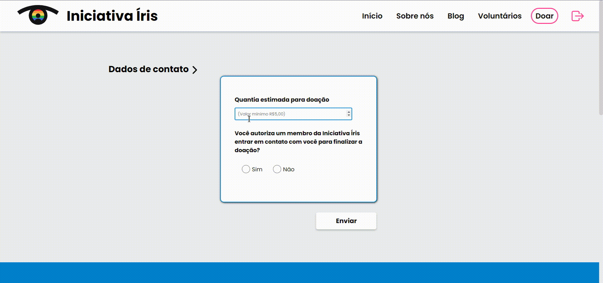

# Iniciativa Íris

An institutional website that brings the iris members closer to the community <br/>

<br/>
<br/>
<br/>
<br/>

Try it out now at: https://iniciativa-iris.vercel.app/

## About

This is a web application that aims to give social and academic support to lgbtqia+ people, through iris initiative.\
Below are the implemented features:

-   Sign In / Sign Up
-   Interactive events with the user
-   MUI libs
-   Forms
-   Data persistence
-   Connection with our own api
-   Google and Facebook OAuth methods
-   Get posts
-   Filter posts
-   Search bar navigation
-   Infinite scroll
-   Interact with community in posts

## Technologies

The following tools and frameworks were used in the construction of the project: <br/>

<div style="display: inline_block"> 
        
        
          
        
        
        
        
</div>

## How to run

1. Clone this repository
2. Clone the back-end repository at https://github.com/GuiCintra27/iris-back-end
3. Follow instructions to run back-end at https://github.com/GuiCintra27/iris-back-end
4. Install dependencies
```bash
npm i
```
5. Run the front-end with
```bash
npm start
```
6. You can optionally build the project running
```bash
npm run build
```
7. Finally access http://localhost:3000 on your favorite browser (unless it is Internet Explorer. In this case, review your life decisions)